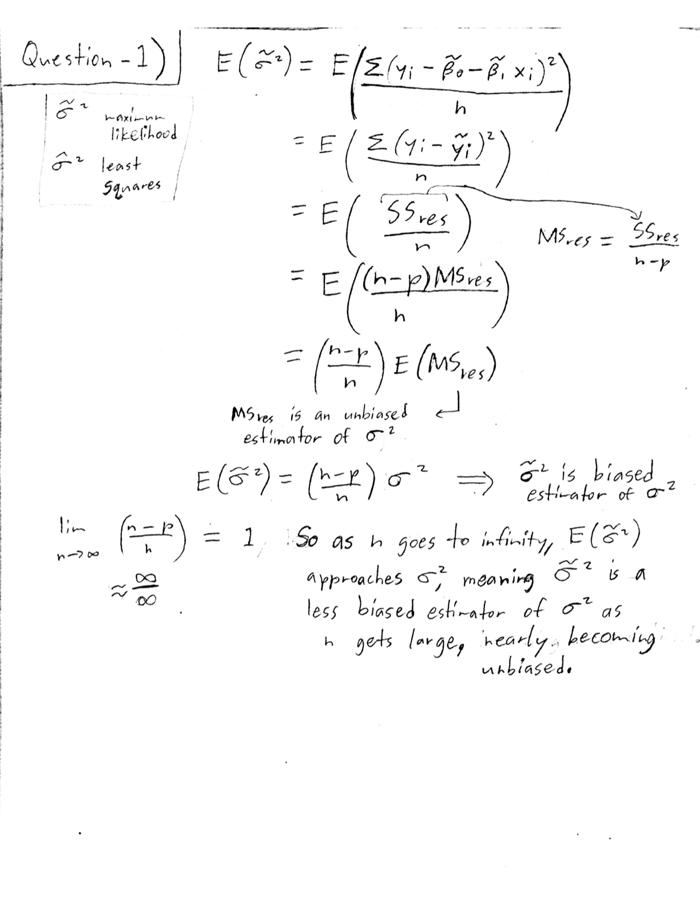
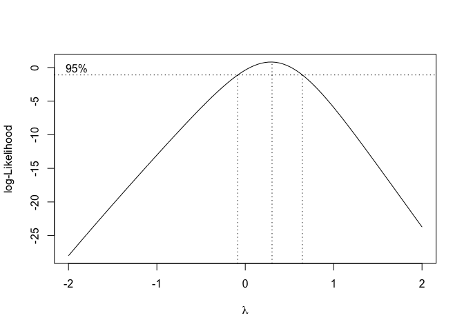
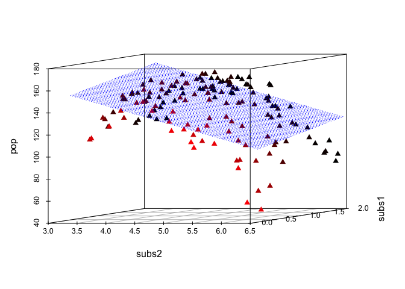
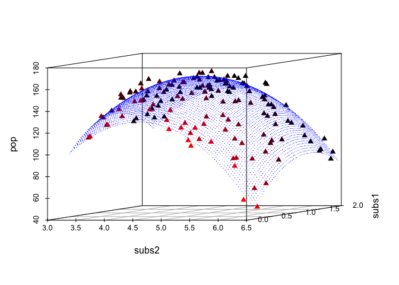

Math 50 Fall 2017, Homework \#3
================

## Question-1.

-   Is maximum-likelihood estimator *σ̃*<sup>2</sup> of *σ*<sup>2</sup> an unbiased estimator ? Verify your answer. Comment on the change of the value of *E*(*σ̃*<sup>2</sup>) − *σ*<sup>2</sup> as *n* goes to infinity.



## Question-2.

-   Consider the shear strength vs age relation using the propellant data.

``` r
prop<-read.table("https://math.dartmouth.edu/~m50f17/propellant.csv", header=T, sep=",")
shearS<-prop$ShearS
age<-prop$Age

plot(age, shearS, xlab = "Propellant Age (weeks)", ylab = "Shear S. (psi)", main = "Rocket Propellant")
fitted <- lm(shearS ~ age)

ageList <- seq(0,25,0.5)
cList <- predict(fitted, list(age = ageList), int = "c", level = 0.95)
pList <- predict(fitted, list(age = ageList), int = "p", level = 0.95)

matlines(ageList, pList, lty='solid' ,  col = "red")
```

<!-- -->

``` r
shTest <- shearS^5 

library(MASS)
bc = boxcox(shTest ~ age)
```

<!-- -->

``` r
lambda <- bc$x[which.max(bc$y)]
```

1 doesn’t seem to be in the approximate CI, therefore Box-Cox method suggests a transformation with *λ* = 0.3030303.

### Part (a)

-   Recalculate the coefficients of the fitted linear regression model using the vector equations we obtained.

``` r
prop<-read.table("https://math.dartmouth.edu/~m50f17/propellant.csv", header=T, sep=",")
ShearS<-prop$ShearS
Age<-prop$Age

c=rep(1,length(Age))
x<-cbind(c,Age)
b_hat = solve((t(x) %*% x)) %*% t(x) %*% ShearS
```

*β*<sub>0</sub>: 2627.822359

*β*<sub>1</sub>: -37.1535909

### Part (b)

-   Suppose that the expectation of the initial shear strength is known to be 2400. Write the corresponding model (should involve only one parameter *β*<sub>1</sub>). Calculate 95% CI on *β*<sub>1</sub>.

``` r
b1_hat_new = sum((ShearS-2400)*Age)/sum((Age)^2)
yhat = 2400 + b1_hat_new*Age
MSres = sum((ShearS - yhat)^2)/length(ShearS)
lower_lim = b1_hat_new - qt(0.975,length(ShearS)-1)*(MSres/sum(Age^2))^0.5
upper_lim = b1_hat_new + qt(0.975,length(ShearS)-1)*(MSres/sum(Age^2))^0.5
```

Confidence interval with initial shear strength set to 2400:
(-28.5287729, -19.7460905)

## Example : Phytoplankton Population

-   A scientist is trying to model the relation between phytoplankton population in the city public water supply and concentration of two substances. The sample data is at : <https://math.dartmouth.edu/~m50f17/phytoplankton.csv>

-   where headers are
    -   pop : population of phytoplankton (*y*)
    -   subs1 : concentration of substance-1 (*x*<sub>1</sub>)
    -   subs2 : concentration of substance-2 (*x*<sub>2</sub>)

-   Lets consider a guessed model  
    *y* = 200 + 10*x*<sub>1</sub> − 15*x*<sub>2</sub>

-   Below is the corresponding code to plot the scatter diagram and the above plane.

``` r
# Note: Run the following in R console if you get errors in plotting or library loading : 
#  install.packages("scatterplot3d") 
#  install.packages("plot3D") 

library("plot3D")
library("scatterplot3d")

# Loading data 
pData <- read.table("https://math.dartmouth.edu/~m50f17/phytoplankton.csv", header=T, sep=",")
pop <- pData$pop
subs1 <- pData$subs1
subs2 <- pData$subs2

# Create a mesh
meshP <- mesh( seq(min(subs1),max(subs1),0.03)  , seq(min(subs2),max(subs2),0.03) )
x1Mesh <- meshP$x 
x2Mesh <- meshP$y 

myModel <- 200 + 10*x1Mesh  - 15 *x2Mesh   

# Below is the code to plot the scatter diagram with red markers and your model
# You need to set two variables before calling : 
# myModel : your model  
# PLOTTING # # # # # # # # # # # # # # # # # # # # # # # # # # # # # # # # #
sc1 <- scatterplot3d(subs2,subs1,pop, pch=17 , type = 'p', angle = 15 , highlight.3d = T ) 
sc1$points3d (x2Mesh,x1Mesh, myModel, cex=.02, col="blue")
```

<!-- -->

``` r
# You can also change the view angle to visually test the model 
# PLOTTING # # # # # # # # # # # # # # # # # # # # # # # # # # # # # # # # #
sc1 <- scatterplot3d(subs2,subs1,pop, pch=17 , type = 'p', angle = 125 , highlight.3d = T ) 
sc1$points3d (x2Mesh,x1Mesh, myModel, cex=.02, col="blue")
```

<!-- -->

## Question-3

-   For the phytoplankton population data use regression model of the form *y* = *β*<sub>0</sub> + *β*<sub>1</sub>*x*<sub>1</sub> + *β*<sub>2</sub>*x*<sub>2</sub> + *ε*.
-   Fit a multiple linear regression model (using (3.13) and hat matrix H). Plot scatter diagram and fitted plane. Print predicted coefficients.
-   Calculate *R*<sup>2</sup> and adjusted *R*<sup>2</sup>.

``` r
pData <- read.table("https://math.dartmouth.edu/~m50f17/phytoplankton.csv", header=T, sep=",")
pop <- pData$pop
subs1 <- pData$subs1
subs2 <- pData$subs2

c = rep(1,length(subs1))
x = cbind(c,subs1,subs2)
H = solve((t(x) %*% x)) %*% t(x)

b_hat = (H %*% pop)
```

*β*<sub>0</sub>: 182.3173554

*β*<sub>1</sub>: 11.9236774

*β*<sub>2</sub>: -12.642746

``` r
meshP <- mesh( seq(min(subs1),max(subs1),0.03)  , seq(min(subs2),max(subs2),0.03) )
x1Mesh <- meshP$x 
x2Mesh <- meshP$y 
myModel <- b_hat[1] + b_hat[2]*x1Mesh + b_hat[3]*x2Mesh

sc1 <- scatterplot3d(subs2,subs1,pop, pch=17 , type = 'p', angle = 15 , highlight.3d = T ) 
sc1$points3d (x2Mesh,x1Mesh, myModel, cex=.02, col="blue")
```

<!-- -->

``` r
yhat = b_hat[1] + b_hat[2]*subs1 + b_hat[3]*subs2
SSr = sum((yhat - mean(pop))^2)
SSres = sum((pop - yhat)^2)
SSt = sum((pop - mean(pop))^2)
Rsq = SSr/SSt
Rsq_adj = 1 - (SSres/(length(pop)-length(b_hat)))/(SSt/(length(pop)-1))
```

*R*<sup>2</sup>: 0.3609532

*R*<sup>2</sup><sub>adj</sub>: 0.3522587

## Question-4

-   This time use a more general model for the phytoplankton population
    data ;  *y* = *β*<sub>0</sub> + *β*<sub>1</sub>*x*<sub>1</sub> + *β*<sub>2</sub>*x*<sub>2</sub> + *β*<sub>11</sub>*x*<sub>1</sub><sup>2</sup> + *β*<sub>22</sub>*x*<sub>2</sub><sup>2</sup> + *β*<sub>12</sub>*x*<sub>1</sub>*x*<sub>2</sub> + *ε*.
-   Fit a multiple linear regression model (using (3.13) and hat matrix H). Plot scatter diagram and fitted surface. Print predicted coefficients.
-   Calculate *R*<sup>2</sup> and adjusted *R*<sup>2</sup>. Compare with the previous model.

``` r
pData <- read.table("https://math.dartmouth.edu/~m50f17/phytoplankton.csv", header=T, sep=",")
pop <- pData$pop
subs1 <- pData$subs1
subs2 <- pData$subs2

c = rep(1,length(subs1))
x = cbind(c,subs1,subs2,subs1^2,subs2^2,subs1*subs2)
H = solve((t(x) %*% x)) %*% t(x)

b_hat = H %*% pop
cat("beta0: ", b_hat[1],"\nbeta1: ",b_hat[2],"\nbeta2: ",b_hat[3],"\nbeta3: ",b_hat[4],"\nbeta4: " ,b_hat[5],"\nbeta5: " ,b_hat[6],"\n")
```

    ## beta0:  -262.3596 
    ## beta1:  62.80095 
    ## beta2:  170.4656 
    ## beta3:  -30.65678 
    ## beta4:  -19.38499 
    ## beta5:  3.688058

``` r
meshP <- mesh( seq(min(subs1),max(subs1),0.03)  , seq(min(subs2),max(subs2),0.03) )
x1Mesh <- meshP$x
x2Mesh <- meshP$y
myModel <- b_hat[1] + b_hat[2]*x1Mesh + b_hat[3]*x2Mesh + b_hat[4]*x1Mesh^2 + b_hat[5]*x2Mesh^2 + b_hat[6]*x1Mesh*x2Mesh

sc1 <- scatterplot3d(subs2,subs1,pop, pch=17 , type = 'p', angle = 15 , highlight.3d = T ) 
sc1$points3d (x2Mesh,x1Mesh, myModel, cex=.02, col="blue")
```

<!-- -->

``` r
yhat = b_hat[1] + b_hat[2]*subs1 + b_hat[3]*subs2 + b_hat[4]*subs1^2 + b_hat[5]*subs2^2 + b_hat[6]*subs1*subs2
SSr = sum((yhat - mean(pop))^2)
SSres = sum((pop - yhat)^2)
SSt = sum((pop - mean(pop))^2)
Rsq = SSr/SSt
Rsq_adj = 1 - (SSres/(length(pop)-length(b_hat)))/(SSt/(length(pop)-1))
```

*R*<sup>2</sup>: 0.9431728

*R*<sup>2</sup><sub>adj</sub>: 0.9411997

The *R*<sup>2</sup> found in Question-4 is far larger than the *R*<sup>2</sup> found in Question-3. The same relation is true when comparing the respective *R*<sup>2</sup>-adjusted values. This means the model from Question-4 better approximates population than the model from Question-3 does.
